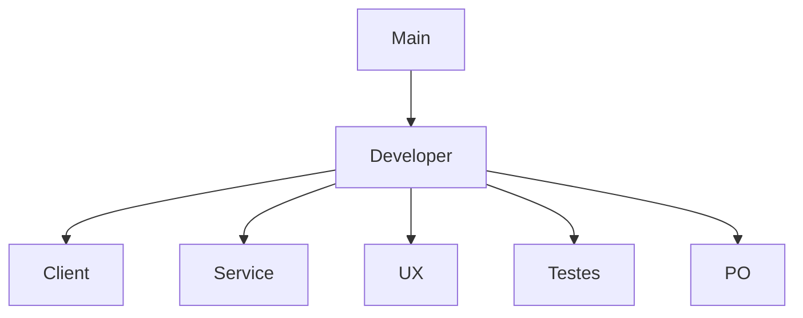

# Desenvolvimento do Projeto

- **Propósito**: Orientar novos colaboradores sobre como contribuir para o projeto, incluindo o processo de configuração do ambiente de desenvolvimento, padrões de código, como enviar pull requests, etc.
- **Conteúdo**: Regras de contribuição, configuração do ambiente, processos de build e deploy, etc.

### FLUXO `git flow`

## Verionamento de codigo

Para definir regras de versionamento de código e permissões de merge no GitHub, você pode configurar as regras de proteção de branch e as políticas de revisão de código. Aqui está um guia passo a passo para configurar essas regras:

### 1. Configurando Regras de Proteção de Branch

1. **Acesse o Repositório no GitHub**:
   - Vá para o seu repositório no GitHub.

2. **Vá para as Configurações**:
   - Clique na aba "Settings" (Configurações).

3. **Branch Protection Rules**:
   - No menu lateral, clique em "Branches" (Branches).
   - Em "Branch protection rules" (Regras de proteção de branch), clique em "Add rule" (Adicionar regra).

4. **Definir Regras de Proteção**:
   - **Branch Name Pattern**: Defina o padrão de nome da branch, como `main`, `developer`, etc.
   - **Require Pull Request Reviews**:
     - Marque a opção "Require pull request reviews before merging" (Requerer revisões de pull request antes de fazer merge).
     - Defina o número de revisores necessários.
   - **Require Status Checks**:
     - Marque a opção "Require status checks to pass before merging" (Requerer verificações de status para passar antes do merge).
     - Adicione os checks de status necessários, como testes automatizados.
   - **Include Administrators**:
     - Marque "Include administrators" (Incluir administradores) se quiser que as regras também se apliquem aos administradores do repositório.
   - **Restrict Who Can Push to Matching Branches**:
     - Marque "Restrict who can push to matching branches" (Restringir quem pode fazer push para branches correspondentes).
     - Adicione os usuários ou equipes autorizados a fazer push diretamente.

5. **Salvar Regras**:
   - Clique em "Create" ou "Save changes" (Salvar alterações).

### 2. Configurando Políticas de Revisão de Código

1. **Criar uma Política de Revisão**:
   - Na seção de "Branch protection rules" (Regras de proteção de branch), defina que os pull requests precisam de aprovação antes de serem mesclados.
   - Especifique o número mínimo de revisores necessários.

2. **Configurar Revisores Padrão**:
   - Nas configurações do repositório, você pode definir revisores padrão para pull requests. Isso pode ser feito através de equipes ou usuários específicos.

### 3. Exemplo de Regras para Branches Específicas

- **Branch `main`**:
  - Nenhum push direto é permitido.
  - Todos os merges devem ser feitos através de pull requests.
  - Pelo menos 2 revisores devem aprovar o pull request.
  - Todos os status checks devem passar antes do merge.

- **Branch `developer`**:
  - Nenhum push direto é permitido.
  - Todos os merges devem ser feitos através de pull requests.
  - Pelo menos 1 revisor deve aprovar o pull request.
  - Todos os status checks devem passar antes do merge.

- **Branches `client`, `service`, `UX`, `Testes`, `PO`**:
  - Push direto pode ser permitido para membros da equipe específica.
  - Recomenda-se o uso de pull requests e revisões, especialmente para mudanças significativas.

Com essas configurações, você garante um fluxo de trabalho de versionamento de código robusto e controlado, minimizando riscos e melhorando a qualidade do código.