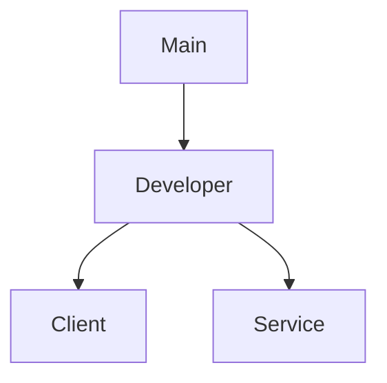
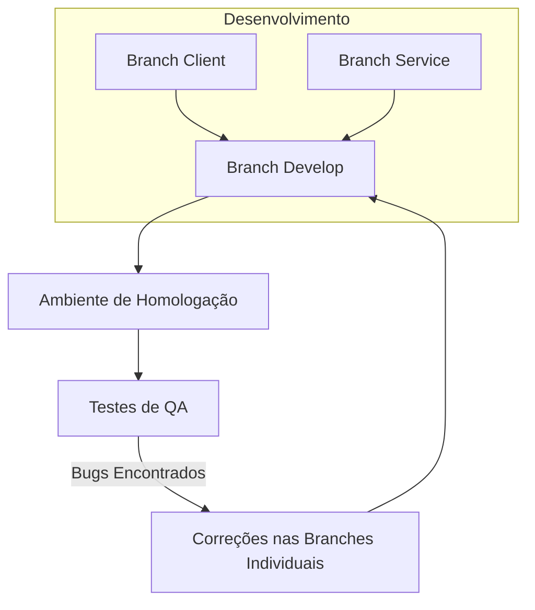

# Desenvolvimento do Projeto

- **Propósito**: Orientar novos colaboradores sobre como contribuir para o projeto, incluindo o processo de configuração do ambiente de desenvolvimento, padrões de código, como enviar pull requests, etc.
- **Conteúdo**: Regras de contribuição, configuração do ambiente, processos de build e deploy, etc.

### FLUXO `git flow`



<details>
<summary>Comandos `git`*</summary>

# Comandos Git e Merge

> **Como inicializo o git no meu meu projeto local?**

- **`git init`**  
  Inicializa um novo repositório Git.

> **Como baixo um repositório remoto para minha máquina?**

- **`git clone <url-do-repositório>`**  
  Clona um repositório remoto para o seu ambiente local.

> **Como vejo as alterações que acabei de fazer no meu projeto?**

- **`git status`**  
  Exibe o status das alterações no repositório.

> **Preparando alterações para subir meu projeto para o repositório remoto**

- **`git add <arquivo-ou-pasta>`**  
  Adiciona arquivos ou mudanças específicas para a área de staging.

- **`git commit -m "mensagem"`**  
  Salva as mudanças no repositório com uma mensagem de commit.

- **`git push <remote> <branch>`**  
  Envia os commits para o repositório remoto.

> **Atualizar repositório local**

- **`git pull <remote> <branch>`**  
  Baixa e incorpora mudanças do repositório remoto na branch atual.

> **Visualizar as branch na sua máquina**

- **`git branch`**  
  Lista todas as branches locais.

> **Navegar pelas branch**

- **`git checkout <branch>`**  
  Muda para uma branch específica.

> **Criar branch**

- **`git checkout -b <nova-branch>`**  
  Cria uma nova branch e muda para ela.

## 2. Comandos de Merge

- **`git merge <branch>`**  
  Mescla a branch especificada na branch atual.

- **`git merge --no-ff <branch>`**  
  Faz o merge criando um commit de merge, mesmo que seja possível fazer um fast-forward.

- **`git merge --squash <branch>`**  
  Mescla as mudanças da branch especificada, mas combina todos os commits em um único commit.

- **`git merge --abort`**  
  Aborta o processo de merge e retorna o repositório ao estado antes do início do merge.

- **`git log --merges`**  
  Exibe uma lista de merges no histórico de commits.

## 3. Resolução de Conflitos

- **`git diff`**  
  Mostra as diferenças entre os arquivos.

- **`git diff --staged`**  
  Mostra as diferenças entre os arquivos preparados para o commit.

- **`git mergetool`**  
  Lança uma ferramenta gráfica para ajudar na resolução de conflitos de merge.

- **`git add <arquivo>`**  
  Marca um arquivo como resolvido após resolver um conflito.

- **`git commit`**  
  Completa o merge após a resolução de conflitos.

## 4. Comandos de Histórico e Revert

- **`git log`**  
  Exibe o histórico de commits.

- **`git log --oneline --graph --decorate --all`**  
  Exibe o histórico de commits em uma linha, com grafo e informações de branch.

- **`git reset --hard <commit>`**  
  Reseta o histórico para um commit específico, descartando mudanças locais.

- **`git revert <commit>`**  
  Reverte um commit específico, criando um novo commit que desfaz as mudanças.

## 5. Outros Comandos Úteis

- **`git stash`**  
  Armazena temporariamente as mudanças não commitadas.

- **`git stash apply`**  
  Aplica as mudanças armazenadas no stash.

- **`git rebase <branch>`**  
  Reaplica os commits da branch atual em cima de outra branch.

- **`git cherry-pick <commit>`**  
  Aplica um commit específico da branch atual ou de outra branch.

- **`git tag <nome-da-tag>`**  
  Marca um ponto específico na história do repositório, como uma versão.

- **`git remote add <nome> <url>`**  
  Adiciona um novo repositório remoto.

- **`git fetch <remote>`**  
  Baixa os commits, branches e tags de um repositório remoto sem integrar as mudanças na branch atual.

- **`git branch -d <branch>`**  
  Deleta uma branch local.

- **`git push origin --delete <branch>`**  
  Deleta uma branch no repositório remoto.

Este guia fornece uma visão geral dos comandos mais utilizados para trabalhar com Git e merges.

</details>

<details>

<summary>
    Regras de versionamento
</summary>
    Para definir regras de versionamento de código e permissões de merge no GitHub, você pode configurar as regras de proteção de branch e as políticas de revisão de código. Aqui está um guia passo a passo para configurar essas regras:

### 1. Configurando Regras de Proteção de Branch

1. **Acesse o Repositório no GitHub**:

   - Vá para o seu repositório no GitHub.

2. **Vá para as Configurações**:

   - Clique na aba "Settings" (Configurações).

3. **Branch Protection Rules**:

   - No menu lateral, clique em "Branches" (Branches).
   - Em "Branch protection rules" (Regras de proteção de branch), clique em "Add rule" (Adicionar regra).

4. **Definir Regras de Proteção**:

   - **Branch Name Pattern**: Defina o padrão de nome da branch, como `main`, `developer`, etc.
   - **Require Pull Request Reviews**:
     - Marque a opção "Require pull request reviews before merging" (Requerer revisões de pull request antes de fazer merge).
     - Defina o número de revisores necessários.
   - **Require Status Checks**:
     - Marque a opção "Require status checks to pass before merging" (Requerer verificações de status para passar antes do merge).
     - Adicione os checks de status necessários, como testes automatizados.
   - **Include Administrators**:
     - Marque "Include administrators" (Incluir administradores) se quiser que as regras também se apliquem aos administradores do repositório.
   - **Restrict Who Can Push to Matching Branches**:
     - Marque "Restrict who can push to matching branches" (Restringir quem pode fazer push para branches correspondentes).
     - Adicione os usuários ou equipes autorizados a fazer push diretamente.

5. **Salvar Regras**:
   - Clique em "Create" ou "Save changes" (Salvar alterações).

### 2. Configurando Políticas de Revisão de Código

1. **Criar uma Política de Revisão**:

   - Na seção de "Branch protection rules" (Regras de proteção de branch), defina que os pull requests precisam de aprovação antes de serem mesclados.
   - Especifique o número mínimo de revisores necessários.

2. **Configurar Revisores Padrão**:
   - Nas configurações do repositório, você pode definir revisores padrão para pull requests. Isso pode ser feito através de equipes ou usuários específicos.

### 3. Exemplo de Regras para Branches Específicas

- **Branch `main`**:

  - Nenhum push direto é permitido.
  - Todos os merges devem ser feitos através de pull requests.
  - Pelo menos 2 revisores devem aprovar o pull request.
  - Todos os status checks devem passar antes do merge.

- **Branch `developer`**:

  - Nenhum push direto é permitido.
  - Todos os merges devem ser feitos através de pull requests.
  - Pelo menos 1 revisor deve aprovar o pull request.
  - Todos os status checks devem passar antes do merge.

- **Branches `client`, `service`, `UX`, `Testes`, `PO`**:
  - Push direto pode ser permitido para membros da equipe específica.
  - Recomenda-se o uso de pull requests e revisões, especialmente para mudanças significativas.

Com essas configurações, você garante um fluxo de trabalho de versionamento de código robusto e controlado, minimizando riscos e melhorando a qualidade do código.

</details>

<details>
    <summary>Modelagem de dados</summary>

# DOCUMENTO DO MODELO DE DADOS

## 1. Introdução e visão Geral

**Objetivo:** Descrever o modelo de dados para um sistema que permite o envio e a pesquisa de preços de medicamentos. O sistema deve permitir que usuários adicionem preços de medicamentos e consultem essas informações para encontrar os melhores preços em diferentes farmácias.

**Escopo:** Este documento cobre o design das tabelas e relacionamentos necessários para suportar as funcionalidades de inclusão e pesquisa de preços de medicamentos.

**Banco de Dados:** O sistema utiliza o PostgreSQL como banco de dados para armazenar e gerenciar as informações.

## 3. Descrição das Entidades

### INFORMAÇÃO IMPORTANTE

<aside>
⚠️ Embora as tabelas e o fluxo de login possam não ser utilizados neste momento do projeto, é crucial manter essa estrutura e modelagem prontas. Isso garantirá que, no futuro, caso haja a necessidade de implementar um sistema de login, já teremos uma base sólida e bem estruturada, facilitando a adaptação e a integração sem a necessidade de um retrabalho significativo.

</aside>

**Usuário**

- **Nome da Entidade:** CustomUser
- **Descrição:** Armazena informações sobre os usuários que enviam informações sobre medicamentos.
- **Atributos:**
  - `id` (PK): Identificador único do usuário.
  - `name`: Nome do usuário.
  - `email`: E-mail do usuário.
  - `password_hash`: Hash (criptografia) da senha do usuário.

**Perfil**

- **Nome da Entidade:** Profile
- **Descrição:** Armazena informações adicionais e personalizáveis do usuário.
- **Atributos:**
  - `id` (PK): Identificador único do perfil.
  - `user_id` (FK): Referência ao usuário (chave estrangeira para a tabela CustomUser).
  - `profile_picture`: URL da foto de perfil.
  - `address`: Endereço do usuário.
  - `additional_info`: Informações adicionais sobre o usuário.

**Atributos do Usuário**

- **Nome da Entidade:** UserAttributes
- **Descrição:** Armazena diferentes atributos e estados do usuário.
- **Atributos:**
  - `id` (PK): Identificador único dos atributos do usuário.
  - `user_id` (FK): Referência ao usuário (chave estrangeira para a tabela Users).
  - `role`: Papel ou permissão do usuário (ex.: 'admin', 'editor', 'viewer').
  - `is_authenticated`: Indica se o usuário está autenticado.
  - `is_active`: Indica se a conta está ativa.
  - `last_login`: Data e hora do último login.

**Tokens**

- **Nome da Entidade:** AuthTokens
- **Descrição:** Armazena tokens de autenticação para os usuários.
- **Atributos:**
  - `id` (PK): Identificador único do token.
  - `user_id` (FK): Identificador do usuário (referência à tabela CustomUser).
  - `access_token`: Token de acesso.
  - `refresh_token`: Token de atualização.
  - `created_at`: Data e hora da criação do token.
  - `expires_at`: Data e hora de expiração do token de acesso.
  - `refresh_expires_at`: Data e hora de expiração do token de atualização.

**Medicamento**

- **Nome da Entidade:** Medicine
- **Descrição:** Armazena informações sobre medicamentos.
- **Atributos:** - `id` (PK): Identificador único do medicamento. - `name`: Nome do medicamento. - `dosage`: Dosagem do medicamento (ex.: "500mg"). - `image`: Imagem da embalagem do medicamento. - `price`: Preço do medicamento. - `date_register`: Data do cadastro do medicamento. - `available_sus`: Indica se o medicamento está disponível no SUS. - `user_id` (FK): Identificador do usuário que enviou o preço (referência à tabela Users). - `pharmacy_id` (FK): Identificador da farmácia onde o medicamento foi comprado (referência à tabela Pharmacy).
  Medicamentos da CMED

- **Nome da Entidade:** MedicineCmed
- **Descrição:** Armazena informações sobre medicamentos que estão cadastrados na CMED.
- **Atributos:**
  - `id` (PK): Identificador único do medicamento.
  - `name`: Nome do medicamento.
  - `dosage`: Dosagem do medicamento (ex.: "500mg").
  - `price`: Preço do medicamento.
  - `date_register`: Data do cadastro do medicamento.
  - `available_sus`: Indica se o medicamento está disponível no SUS.

**Farmácia**

- **Nome da Entidade:** Pharmacy
- **Descrição:** Armazena informações sobre farmácias.
- **Atributos:**
  - `id` (PK): Identificador único da farmácia.
  - `name`: Nome da farmácia.
  - `cep`: CEP da farmácia.
  - `address`: Endereço da farmácia.
  - `city`: Cidade onde a farmácia está localizada.
  - `state`: Estado onde a farmácia está localizada.

## 4. Relacionamentos

- **CustomUser - Medicine**: Um usuário pode enviar informações sobre vários medicamentos.
- **Pharmacy - Medicine**: Uma farmácia pode ter vários medicamentos registrados com preços diferentes.
- **Medicine - CustomUser**: Um medicamento pode ser associado a um único usuário que enviou a informação.
- **Medicine - Pharmacy**: Um medicamento pode ser associado a uma única farmácia onde foi registrado o preço.
- **CustomUser - Profile**: Um usuário pode ter um perfil adicional com informações detalhadas.
- **CustomUser - UserAttributes**: Um usuário pode ter atributos adicionais armazenados separadamente.
- **CustomUser - Tokens**: Um usuário pode ter múltiplos tokens de autenticação.

## **5. Regras de Negócio e Restrições**

- **Nome do Medicamento**: O nome do medicamento deve ser cadastrado exatamente como aparece na lista da CMED, garantindo conformidade com a nomenclatura oficial.
- **Preço**: Deve ser um valor numérico positivo, representado com duas casas decimais.
- **Data de Registro**: Deve ser uma data válida e não pode ser uma data futura.
- **Disponibilidade no SUS**: Deve ser um valor booleano (verdadeiro ou falso) indicando se o medicamento está disponível no SUS.

## **6. Regras de Validação de Dados**

**E-mail**

- **Formato**: O e-mail deve ser um endereço de e-mail válido, seguindo a sintaxe padrão (`user@example.com`). A validação pode ser implementada com uma expressão regular, como `'^.+@.+\..+$'`.
- **Unicidade**: O e-mail deve ser único em todo o sistema. Não são permitidos e-mails duplicados.

**Senha**

- **Comprimento**: A senha deve ter no mínimo 8 caracteres e no máximo 255 caracteres.
- **Complexidade**: A senha deve conter pelo menos uma letra maiúscula, uma letra minúscula, um número e um caractere especial (ex.: `!@#$%^&*()`).
- **Hashing**: As senhas devem ser armazenadas como hashes criptografados usando um algoritmo seguro.

**Nome do Usuário**

- **Comprimento**: O nome do usuário deve ter no mínimo 1 caractere e no máximo 255 caracteres.
- **Formato**: O nome não deve conter caracteres especiais, apenas letras e espaços.

**Preço do Medicamento**

- **Valor**: O preço deve ser um valor numérico positivo com duas casas decimais. Deve ser representado como `DECIMAL(10, 2)`.
- **Validação**: Deve ser maior que zero.

**Data de Registro**

- **Formato**: A data deve estar no formato `YYYY-MM-DD`.
- **Validação**: A data de registro não pode ser uma data futura.

**Disponibilidade no SUS**

- **Tipo**: Deve ser um valor booleano (verdadeiro ou falso).

**URL de Imagem**

- **Formato**: A URL deve ser uma string válida que aponta para uma imagem. Não deve exceder 255 caracteres.

## **7. Procedimentos de Migração e Atualização**

**Script de Criação**:

```sql
sqlCopiar código
CREATE TABLE CustomUser (
    id SERIAL PRIMARY KEY,
    name VARCHAR(255) NOT NULL,
    email VARCHAR(255) UNIQUE NOT NULL,
    password VARCHAR(255) NOT NULL
);

CREATE TABLE Profile (
    id SERIAL PRIMARY KEY,
    profile_picture VARCHAR(255),
    address VARCHAR(255),
    additional_info TEXT,
    user_id INTEGER REFERENCES CustomUser(id)
);

CREATE TABLE UserAttributes (
    id SERIAL PRIMARY KEY,
    role VARCHAR(45),
    is_authenticated BOOLEAN,
    is_active BOOLEAN,
    last_login TIMESTAMP,
    user_id INTEGER REFERENCES CustomUser(id)
);

CREATE TABLE Tokens (
    id SERIAL PRIMARY KEY,
    user_id INTEGER REFERENCES CustomUser(id),
    access_token VARCHAR(512),
    refresh_token VARCHAR(512),
    created_at TIMESTAMP NOT NULL,
    expires_at TIMESTAMP NOT NULL,
    refresh_expires_at TIMESTAMP NOT NULL
);

CREATE TABLE Pharmacy (
    id SERIAL PRIMARY KEY,
    name VARCHAR(255) NOT NULL,
    cep VARCHAR(20) NOT NULL,
    address VARCHAR(255) NOT NULL,
    city VARCHAR(100) NOT NULL,
    state VARCHAR(100) NOT NULL
);

CREATE TABLE Medicine (
    id SERIAL PRIMARY KEY,
    name VARCHAR(255) NOT NULL,
    dosage VARCHAR(50),
    chemical_name VARCHAR(255),
    image VARCHAR(255),
    price DECIMAL(10, 2) NOT NULL,
    date_register DATE NOT NULL,
    available_sus BOOLEAN,
    user_id INTEGER REFERENCES CustomUser(id),
    pharmacy_id INTEGER REFERENCES Pharmacy(id)
);

```

## **Conclusão**

<<<<<<< HEAD
Esta documentação cobre o modelo de dados e as funcionalidades principais para o sistema de inclusão e consulta de preços de medicamentos. Inclui agora a estrutura necessária para a gestão de tokens de autenticação. Se precisar de ajustes ou mais detalhes, estou aqui para ajudar! ...

</details>
<details>
<summary>
 Atualizar Branch Filha
</summary>

**Para atualizar uma branch filha com as mudanças da branch pai, você pode seguir um dos métodos abaixo**:

### 1. **Usando `merge`**
Este método é utilizado quando você quer incorporar as mudanças da branch pai (por exemplo, `develop`) na branch filha (por exemplo, `client`).

```bash
# Vá para a branch filha (client)
git checkout client

# Faça o merge da branch pai (develop) na branch filha (client)
git merge develop
```

### 2. **Usando `rebase`**
Este método reescreve o histórico da branch filha para parecer que ela foi criada a partir do commit mais recente da branch pai. Isso é útil para manter um histórico de commits mais linear.

```bash
# Vá para a branch filha (client)
git checkout client

# Faça o rebase da branch filha (client) com a branch pai (develop)
git rebase develop
```

### Considerações
- **`merge`** cria um commit de merge, o que pode ser útil para manter um histórico claro de quando as mudanças foram integradas.
- **`rebase`** reescreve o histórico e é útil para manter um histórico mais limpo e linear, mas pode ser mais complexo de usar, especialmente se houver conflitos.

Escolha o método que melhor se adapta ao fluxo de trabalho do seu projeto.
</details>
<details>
    <summary>Atualizando Branch</summary>
    Para puxar as atualizações da branch pai para a sua branch atual, você pode usar um dos seguintes comandos, dependendo da estratégia de integração que você deseja adotar:

### 1. **Merge (Padrão)**

Essa opção criará um merge commit, combinando as mudanças da branch pai com a sua branch atual.

```bash
git merge nome-da-branch-pai
```

### 2. **Rebase**

Essa opção aplicará as mudanças da branch pai no topo da sua branch atual, mantendo um histórico linear.

```bash
git rebase nome-da-branch-pai
```

### 3. **Fast-forward**

Se você sabe que as mudanças na sua branch atual podem ser aplicadas diretamente após as mudanças da branch pai (sem a necessidade de um merge commit), use:

```bash
git merge --ff-only nome-da-branch-pai
```

### Passo a Passo

1. **Certifique-se de estar na sua branch atual:**

   ```bash
   git checkout sua-branch
   ```

2. **Puxe as últimas atualizações da branch pai para garantir que você está sincronizado com o repositório remoto:**

   ```bash
   git fetch origin nome-da-branch-pai
   ```

3. **Realize a integração usando uma das estratégias acima:**
   - Com `git merge`, `git rebase` ou `git merge --ff-only`, conforme explicado.

### Exemplo

Se sua branch atual é `feature` e a branch pai é `develop`, você faria o seguinte:

```bash
git checkout feature
git fetch origin develop
git merge develop   # ou git rebase develop
```

Isso integrará as últimas mudanças da branch `develop` na sua branch `feature`.

</details>

## Ferramentas

<details>
    <summary>Vite</summary>
    
A biblioteca **Vite** é uma ferramenta de construção de projetos moderna, focada em melhorar a experiência de desenvolvimento para aplicações web. Aqui estão alguns dos principais pontos sobre o Vite:

### Principais Características

1. **Desempenho Rápido**:

   - Utiliza **ES modules** no navegador para otimizar o tempo de carregamento durante o desenvolvimento.
   - O tempo de inicialização e recarregamento é significativamente reduzido, permitindo um fluxo de trabalho mais ágil.

2. **Hot Module Replacement (HMR)**:

   - O Vite oferece HMR extremamente rápido, permitindo que as alterações no código sejam refletidas no navegador em tempo real, sem perder o estado da aplicação.

3. **Compatibilidade com Frameworks**:

   - Suporta diversos frameworks populares como **Vue**, **React**, **Svelte**, entre outros, facilitando o desenvolvimento independente do framework escolhido.

4. **Configuração Simples**:

   - A configuração é simplificada e pode ser feita através de um arquivo `vite.config.js`, permitindo personalizações conforme a necessidade do projeto.

5. **Build Otimizada**:

   - Para produção, o Vite utiliza **Rollup** para otimização de builds, permitindo que você aproveite recursos avançados de empacotamento.

6. **Plugin Ecosystem**:
   - Possui um ecossistema de plugins, permitindo que os desenvolvedores estendam as funcionalidades do Vite para atender a necessidades específicas.

# Documentação de Instalação do Projeto Vite

Esta documentação é destinada a desenvolvedores que desejam contribuir com o projeto criado com Vite. Siga os passos abaixo para configurar o ambiente de desenvolvimento.

## Pré-requisitos

- **Node.js** (versão 12 ou superior)
- **npm** (geralmente vem instalado com o Node.js)

## Passo a Passo para Instalação

### 1. Clonar o Repositório

Use o comando abaixo para clonar o repositório do projeto:

```bash
git clone <URL_DO_REPOSITÓRIO>
```

### 2. Navegar para o Diretório do Projeto

Entre no diretório do projeto clonado:

```bash
cd <NOME_DO_DIRETÓRIO>
```

### 3. Instalar Dependências

Execute o comando para instalar as dependências do projeto:

```bash
npm install
```

### 4. Iniciar o Servidor de Desenvolvimento

Para iniciar o servidor de desenvolvimento, utilize o seguinte comando:

```bash
npm run dev
```

### 5. Acessar a Aplicação

Abra seu navegador e acesse:

```
http://localhost:3000
```

### 6. Contribuindo

- Faça suas alterações no código.
- Teste suas alterações localmente.
- Para enviar suas contribuições, crie uma _branch_ e abra um _pull request_.

## Conclusão

Agora você está pronto para começar a colaborar no projeto! Se tiver dúvidas, consulte a documentação ou entre em contato com o time.

</details>

<details>
 <summary>
    Team QAs
 </summary>

> Esse README ajuda a estruturar o processo de homologação e garantir que todos os envolvidos no projeto estejam alinhados com os procedimentos de qualidade.

## Homologação e Testes de Qualidade

### Fluxo de Homologação

Os desenvolvedores devem seguir o seguinte fluxo para garantir que o código seja devidamente testado antes de ser integrado à branch principal:

1. **Desenvolvimento**: Cada desenvolvedor trabalha em uma branch separada (ex: `client`, `service`).
2. **Atualização da Branch `develop`**: Após concluir a tarefa, o desenvolvedor faz um merge da sua branch (`client` ou `service`) na branch `develop`.
3. **Homologação**: A branch `develop` é usada exclusivamente para testes de QA. Ela deve estar sempre atualizada com as últimas mudanças para que os QAs possam realizar seus testes.
4. **Testes de QA**: Os QAs acessam o ambiente de homologação onde a branch `develop` está rodando para realizar os testes.
5. **Correções e Ajustes**: Caso sejam identificados bugs ou problemas, as correções são feitas nas branches correspondentes (`client`, `service`) e, após validadas, são novamente integradas à branch `develop`.


=======
Esta documentação cobre o modelo de dados e as funcionalidades principais para o sistema de inclusão e consulta de preços de medicamentos. Inclui agora a estrutura necessária para a gestão de tokens de autenticação.


>>>>>>> main

</details>
