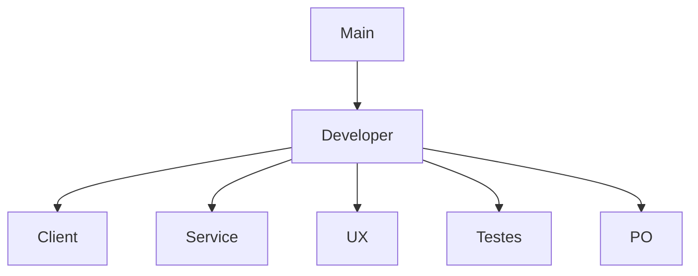

# Desenvolvimento do Projeto

- **Propósito**: Orientar novos colaboradores sobre como contribuir para o projeto, incluindo o processo de configuração do ambiente de desenvolvimento, padrões de código, como enviar pull requests, etc.
- **Conteúdo**: Regras de contribuição, configuração do ambiente, processos de build e deploy, etc.

### FLUXO `git flow`

